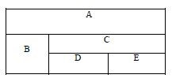
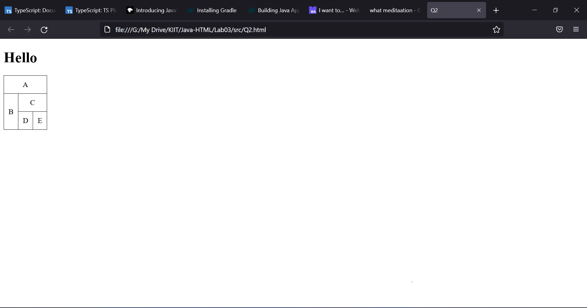
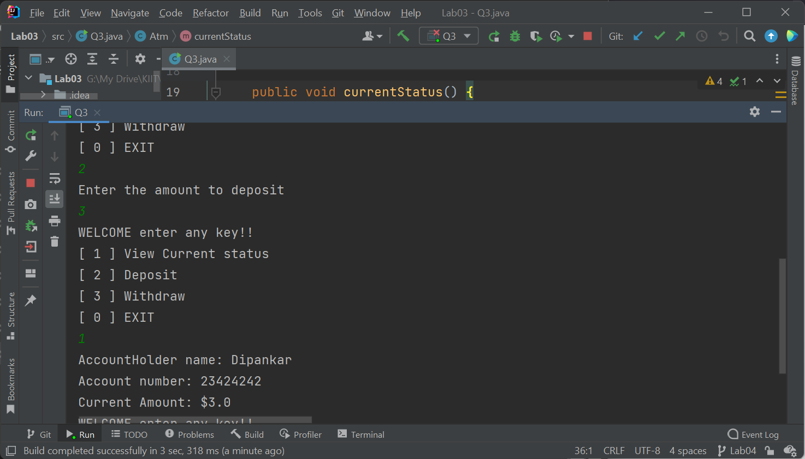

# WT Lab03
`Author: Dipankar Das`

`Date: 28-1-2022`

`Roll: 20051554`

## Question 1
Write a html program



### Solution
```HTML
<!DOCTYPE html>
<html lang="en">
<head>
    <meta charset="UTF-8">
    <title>Q2</title>
    <style>
        table, tr, td{
            padding: 10px 10px;
            text-align: center;
            border: 1px solid black;
            border-collapse: collapse;
        }

    </style>
</head>
<body>
    <h1>Hello</h1>
    <table>
        <tr>
            <td colspan="3">A</td>
        </tr>
        <tr>
            <td rowspan="2">B</td>
            <td colspan="2">C</td>
        </tr>
        <tr>
            <td>D</td>
            <td>E</td>
        </tr>
    </table>
</body>
</html>
```
### Output



## Question 2
Create a class ATM illustrating the functionality of ATM. Use switch case for the same. 

### Solution
```JAVA

//Create a class ATM illustrating the functionality of ATM.
// Use switch case for the same.

import java.util.*;
import java.io.*;

class Atm {
    private String custName;
    private long accNo;
    private float currAmt;

    public Atm(String n, long acc, float amt) {
        this.custName = n;
        this.accNo = acc;
        this.currAmt = amt;
    }

    public void currentStatus() {
        System.out.println("AccountHolder name: "+custName);
        System.out.println("Account number: "+accNo);
        System.out.println("Current Amount: $"+currAmt);
    }

    public void deposit(float amt) {
        this.currAmt = amt;
    }

    public float withdraw(float amtToWithdraw) {
        if (currAmt < amtToWithdraw) {
            return Float.MIN_VALUE;
        }
        currAmt -= amtToWithdraw;
        return amtToWithdraw;
    }
}

public class Q3 {
    public static void main(String[] args) {
        Scanner in = new Scanner(System.in);
        System.out.println("Enter your name and account no");
        String n = in.nextLine();
        long accNo = in.nextLong();

        Atm o =new Atm(n,accNo, 0.0f);

        while(true) {
            int choice;
            System.out.println("WELCOME enter any key!!");
            System.out.println("[ 1 ] View Current status");
            System.out.println("[ 2 ] Deposit");
            System.out.println("[ 3 ] Withdraw");
            System.out.println("[ 0 ] EXIT");
            choice = in.nextInt();
            boolean flag = false;
            switch(choice) {
                case 0:
                    flag = true;
                    break;
                case 1:
                    o.currentStatus();
                    break;
                case 2:
                    System.out.println("Enter the amount to deposit");
                    float a = in.nextFloat();
                    o.deposit(a);
                    break;
                case 3:
                    System.out.println("Enter the amount to withdraw");
                    float wd = in.nextFloat();
                    float ret =  o.withdraw(wd);
                    if (ret == Float.MIN_VALUE) {
                        System.out.println("Insufficient balance");
                        break;
                    }
                    System.out.println("Amount withdrawn: $"+ret);
                    break;
                default:
                    System.out.println("INV KEY pressed");
                    flag = true;
                    break;
            }
            if (flag)
                break;
        }
        System.out.println("BYE!!");
        in.close();
    }
}

```
### Output
