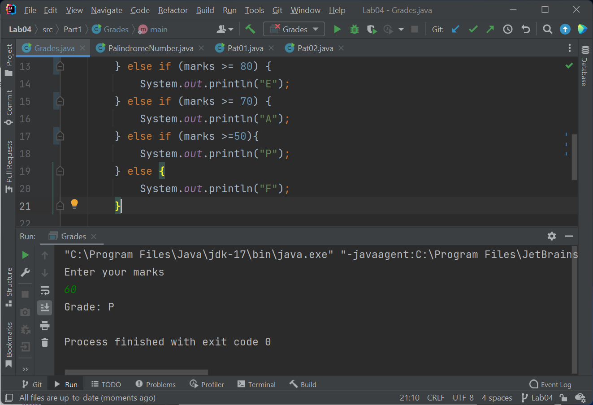
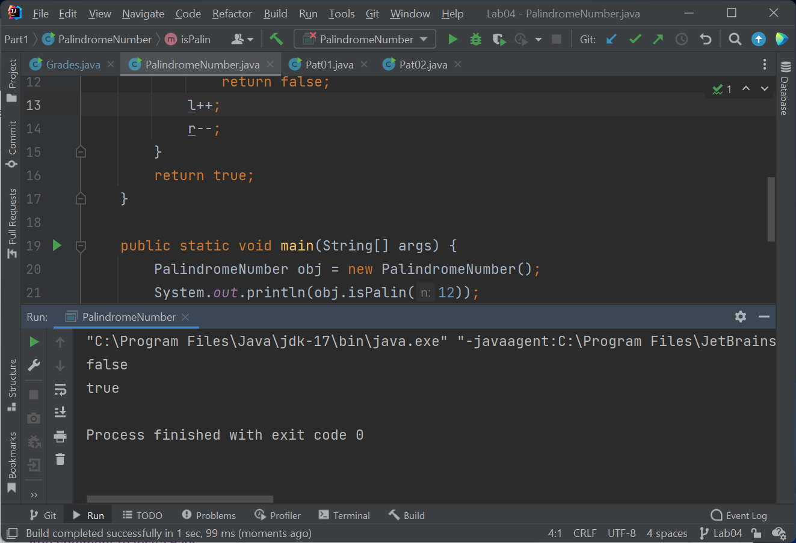
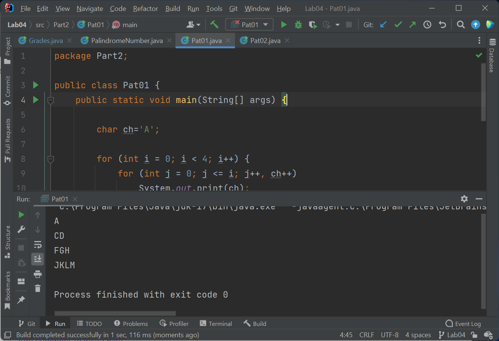
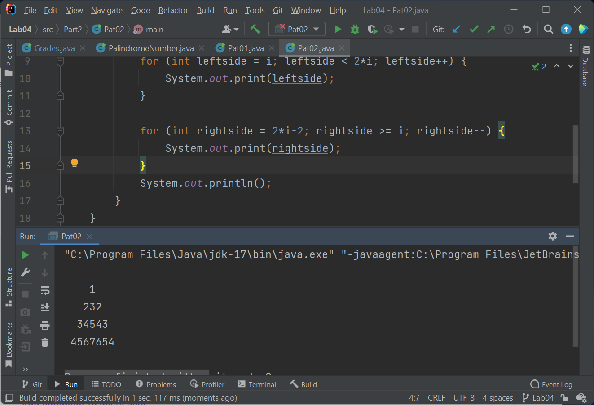

# WT Lab04
`Author: Dipankar Das`

`Date: 5-2-2022`

`Roll: 20051554`

## Question 1
Program to print the corresponding grade for the given mark using
if..else statement in Java

### Solution
```JAVA
package Part1;

import java.util.Scanner;

public class Grades {
    public static void main(String[] args) {
        Scanner in = new Scanner(System.in);
        System.out.println("Enter your marks");
        int marks = in.nextInt();
        System.out.print("Grade: ");
        if (marks >= 90) {
            System.out.println("O");
        } else if (marks >= 80) {
            System.out.println("E");
        } else if (marks >= 70) {
            System.out.println("A");
        } else if (marks >=50){
            System.out.println("P");
        } else {
            System.out.println("F");
        }

        in.close();
    }
}
```
### Output



## Question 2
Program to check a user entered number is palindrome or not.

### Solution
```JAVA
package Part1;

public class PalindromeNumber {

    private boolean isPalin(int n) {
        String str = Integer.toString(n);

        int l = 0;
        int r = str.length()-1;
        while (l < r) {
            if (str.charAt(l) != str.charAt(r))
                return false;
            l++;
            r--;
        }
        return true;
    }

    public static void main(String[] args) {
        PalindromeNumber obj = new PalindromeNumber();
        System.out.println(obj.isPalin(12));
        System.out.println(obj.isPalin(121));
    }
}

```
### Output



## Question 3
Print the following pattern:
```
A
CD
FGH
JKLM
```
### Solution
```JAVA
package Part2;

public class Pat01 {
    public static void main(String[] args) {

        char ch='A';

        for (int i = 0; i < 4; i++) {
            for (int j = 0; j <= i; j++, ch++)
                System.out.print(ch);
            ch++;
            System.out.println();
        }
    }
}

```
### Output



## Question 4
Print the following pattern:
```
     1
    232
   34543
  4567654
```
### Solution
```JAVA
package Part2;

public class Pat02 {
    public static void main(String[] args) {
        for (int i = 0; i < 5; i++) {
            for (int sp = 0; sp < 5 - i; sp++) {
                System.out.print(" ");
            }
            for (int leftside = i; leftside < 2*i; leftside++) {
                System.out.print(leftside);
            }

            for (int rightside = 2*i-2; rightside >= i; rightside--) {
                System.out.print(rightside);
            }
            System.out.println();
        }
    }
}

```
### Output
