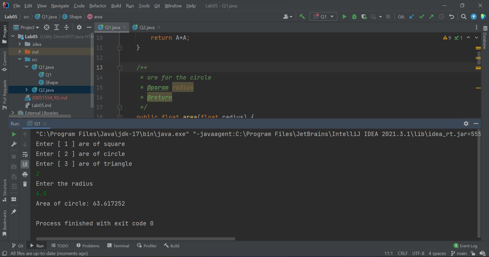

# WT Lab05
`Author: Dipankar Das`

`Date: 11-2-2022`

`Roll: 20051554`

## Question 1
Write a program which will overload the area () method and display the
area of a circle, triangle and square as per user choice and user entered
dimensions. Consider the class as Shape.

### Solution
```JAVA
import java.util.Scanner;

class Shape {
    /**
     * @def area() for the square
     * @param A
     * @return
     */
    public int area(int A) {
        return A*A;
    }

    /**
     * are for the circle
     * @param radius
     * @return
     */
    public float area(float radius) {
        return (float)(Math.PI) * radius * radius;
    }

    /**
     * def are of rightangled triangle
     * @param base
     * @param height
     * @return
     */
    public float area (float base, float height) {
        return 0.5f * base * height;
    }


}

public class Q1 {
    public static void main(String[] args) {
        Shape sh = new Shape();
        Scanner in = new Scanner(System.in);
        int choice;
        System.out.println("Enter [ 1 ] are of square");
        System.out.println("Enter [ 2 ] are of circle");
        System.out.println("Enter [ 3 ] are of triangle");
        choice = in.nextInt();
        switch(choice) {
            case 1:
                System.out.println("Enter the side length");
                int l = in.nextInt();
                System.out.println("Area of square: " + sh.area(l));
                break;
            case 2:
                System.out.println("Enter the radius");
                float r = in.nextFloat();
                System.out.println("Area of circle: " + sh.area(r));
                break;

            case 3:
                System.out.println("Enter the height, base for the triangle");
                float h = in.nextFloat();
                float b = in.nextFloat();
                System.out.println("Area of triangle: " + sh.area(b, h));
                break;
            default:
                System.err.println("Inv choice");
        }
    }
}

```
### Output



## Question 2
Create a class called 'Matrix' containing constructor that initializes the
number of rows and number of columns of a new Matrix object. The
Matrix class has the following information:
number of rows of matrix, number of columns of matrix, elements of
matrix in the form of 2D array.
The Matrix class has methods for each of the following:
1. get the number of rows
2. get the number of columns
3. set the elements of the matrix at given position (i,j)
4. adding two matrices. If the matrices are not addable, "Matrices cannot be added" will be displayed.
5. multiplying the two matrices

### Solution
```JAVA
import java.util.Scanner;

class Matrix {

    private int rows;
    private int cols;
    private int[][] matrix;

    public Matrix(int rows, int cols) {
        this.rows = rows;
        this.cols = cols;
        this.matrix = new int[this.rows][this.cols];
    }
    public void setMatrix(int i, int j, int ele) {
        matrix[i][j] = ele;
    }
    public void display() {
        for (int[] rows : matrix) {
            for (int e : rows)
                System.out.print(e + " ");
            System.out.println();
        }
    }

    public int getRows() {
        return rows;
    }

    public int getCols() {
        return cols;
    }

    public void addition(Matrix mat2) {
        if (mat2.cols != this.cols || mat2.rows != this.rows) {
            System.err.println("Matrices cannot be added");
            return;
        }

        for (int i = 0; i < rows; i++) {
            for (int j = 0; j < cols; j++) {
                // by default this.matrix is getting modified
                this.matrix[i][j] += mat2.matrix[i][j];
            }
        }

        System.out.println("Done result");
        this.display();
    }

    public void multiplication(Matrix mat2) {
        if (this.cols != mat2.rows)
        {
            System.err.println("Matrices cannot be multiplied");
            return;
        }

        int[][] mul = new int[this.rows][mat2.cols];

        for (int rowMat1 = 0; rowMat1 < this.rows; rowMat1++) {
            for (int colMat2 = 0; colMat2 < mat2.cols; colMat2++) {
                for (int rowMat2 = 0; rowMat2 < mat2.rows; rowMat2++) {
                    mul[rowMat1][colMat2]
                            += this.matrix[rowMat1][rowMat2] * mat2.matrix[rowMat2][colMat2];
                }
            }
        }
        this.cols = mat2.cols;
        this.matrix = mul;


        System.out.println("Done result");
        this.display();
    }

}

public class Q2 extends Matrix{

    public Q2(int r, int c) {
        super(r, c);
    }

    public static void main(String[] args) {
        Scanner in = new Scanner(System.in);
        System.out.println("Enter the number of rows & cols");
        int r = in.nextInt();
        int c = in.nextInt();
        Q2 obj = new Q2(r, c);
        System.out.println("First enter the data");
        for (int i = 0; i < r; i++) {
            for (int j = 0; j < c; j++) {
                obj.setMatrix(i,j, in.nextInt());
            }
        }

        int ch;
        Q2 mat2 = new Q2(r, c);
        System.out.println("second matrix enter the data");
        for (int i = 0; i < r; i++) {
            for (int j = 0; j < c; j++) {
                mat2.setMatrix(i,j, in.nextInt());
            }
        }
        do {
            System.out.println("Enter [ 0 ] to EXIT");
            System.out.println("Enter [ 1 ] to number of rows");
            System.out.println("Enter [ 2 ] to number of cols");
            System.out.println("Enter [ 3 ] to set at particular");
            System.out.println("Enter [ 4 ] to display");
            System.out.println("Enter [ 5 ] add 2 matrixs");
            System.out.println("Enter [ 6 ] multiply 2 matrix");
            ch = in.nextInt();

            switch(ch) {
                case 0-> System.err.println("EXITING CODE 0x0001");
                case 1-> System.out.println(obj.getRows());
                case 2-> System.out.println(obj.getCols());
                case 3-> {
                    System.out.println("Enter the [i, j] and the element to enter");
                    int i, j, ele;
                    i = in.nextInt();
                    j = in.nextInt();
                    ele = in.nextInt();
                    obj.setMatrix(i,j,ele);
                }
                case 4 -> obj.display();

                case 5-> obj.addition(mat2);

                case 6-> obj.multiplication(mat2);

                default -> System.err.println("Inv");
            }
        }while(ch != 0);
    }
}

```
### Output


