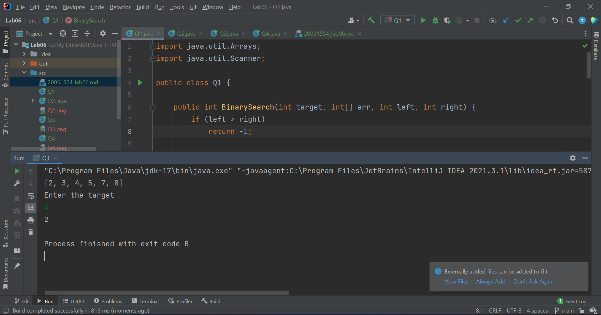
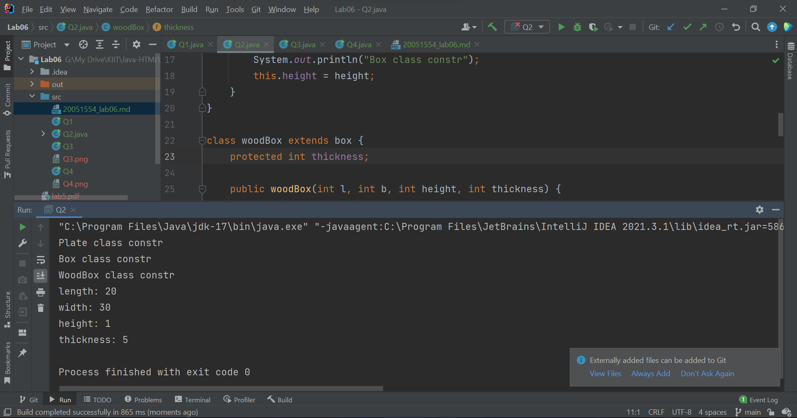
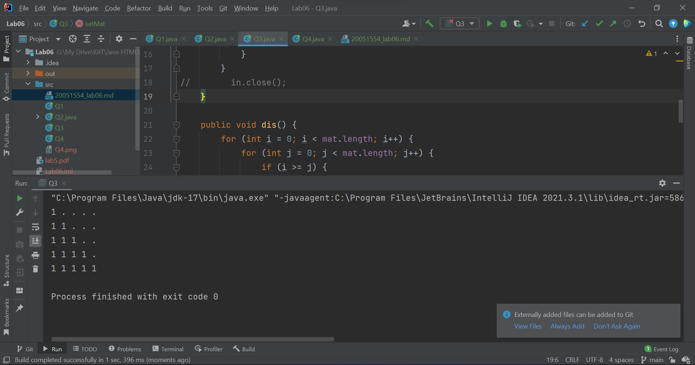
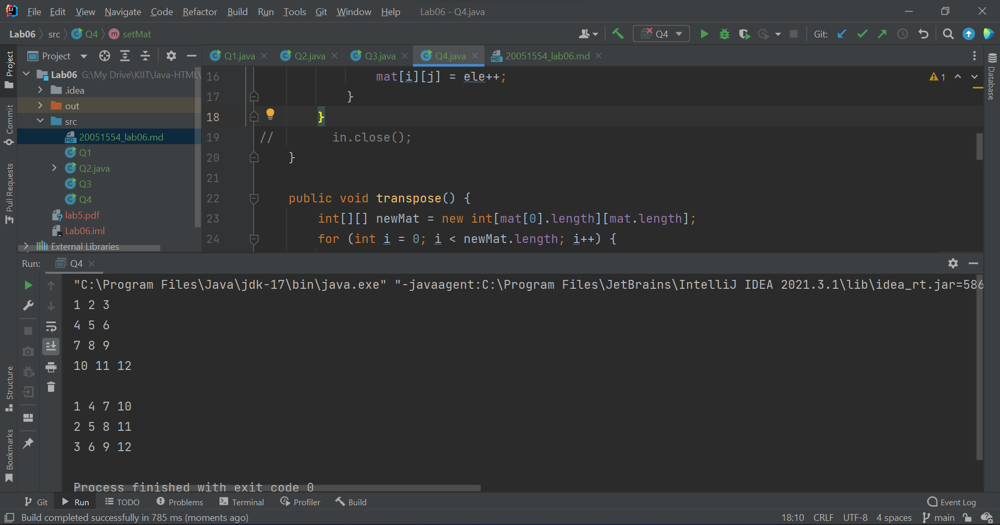

# WT Lab06
`Author: Dipankar Das`

`Date: 18-2-2022`

`Roll: 20051554`

## Question 1
WAP in Java to implement Binary search in a 1D array

### Solution
```JAVA
import java.util.Arrays;
import java.util.Scanner;

public class Q1 {

    public int BinarySearch(int target, int[] arr, int left, int right) {
        if (left > right)
            return -1;

        int mid = left + (right - left)/ 2;
        if (arr[mid] == target)
            return mid;
        if (arr[mid] < target)
            return BinarySearch(target, arr,  mid + 1, right);
        else
            return BinarySearch(target, arr, left, mid - 1);
    }

    public static void main(String[] args) {
        Q1 o = new Q1();
        int[] arr = new int[]{3,4,7,2,5,8};
        Arrays.sort(arr);
        System.out.println(Arrays.toString(arr));
        System.out.println("Enter the target");
        int target = new Scanner(System.in).nextInt();
        System.out.println(o.BinarySearch(target, arr, 0, arr.length-1));
    }
}

```
### Output



## Question 2
Illustrate the execution of constructors in multi-level inheritance with
three Java classes – plate(length, width), box(length, width, height), wood
box(length, width, height, thickness).


### Solution
```JAVA

class plate {
    protected int length, width;

    public plate(int length, int width) {
        System.out.println("Plate class constr");
        this.length = length;
        this.width = width;
    }
}

class box extends plate{
    protected int height;

    public box(int l, int b, int height) {
        super(l,b);
        System.out.println("Box class constr");
        this.height = height;
    }
}

class woodBox extends box {
    protected int thickness;

    public woodBox(int l, int b, int height, int thickness) {
        super(l, b, height);
        System.out.println("WoodBox class constr");
        this.thickness = thickness;
    }
    public void data() {
        System.out.println("length: " + length);
        System.out.println("width: " + width);
        System.out.println("height: " + height);
        System.out.println("thickness: " + thickness);
    }
}

public class Q2 {
    public static void main(String[] args) {
        woodBox obj = new woodBox(20, 30, 1, 5);
        obj.data();
    }
}

```
### Output



## Question 3
Java Program to display the lower triangular matrix

### Solution
```JAVA
import java.util.Scanner;

public class Q3 {
    int[][] mat;
    public Q3 (int N) {
        mat = new int[N][N];
        setMat();
    }

    private void setMat() {
//        Scanner in = new Scanner(System.in);
        for (int i = 0; i < mat.length; i++) {
            for (int j = 0; j < mat.length; j++) {
//                mat[i][j] = in.nextInt();
                mat[i][j] = 1;
            }
        }
//        in.close();
    }

    public void dis() {
        for (int i = 0; i < mat.length; i++) {
            for (int j = 0; j < mat.length; j++) {
                if (i >= j) {
                    System.out.print(mat[i][j] + " ");
                } else {
                    System.out.print(". ");
                }
            }
            System.out.println();
        }
    }

    public static void main(String[] args) {
        Q3 o = new Q3(5);
        o.dis();
    }
}

```
### Output



## Question 4
Java Program to find the transpose of a given matrix

### Solution
```JAVA
import java.util.Scanner;

public class Q4 {
    int[][] mat;
    public Q4 (int M, int N) {
        mat = new int[M][N];
        setMat();
    }

    private void setMat() {
//        Scanner in = new Scanner(System.in);
        int ele = 1;
        for (int i = 0; i < mat.length; i++) {
            for (int j = 0; j < mat[0].length; j++) {
//                mat[i][j] = in.nextInt();
                mat[i][j] = ele++;
            }
        }
//        in.close();
    }

    public void transpose() {
        int[][] newMat = new int[mat[0].length][mat.length];
        for (int i = 0; i < newMat.length; i++) {
            for (int j = 0; j < newMat[0].length; j++) {
                newMat[i][j] = mat[j][i];
            }
        }
        mat = newMat;
    }

    public void dis() {
        for (int[] row : mat) {
            for (int ele : row) {
                System.out.print(ele + " ");
            }
            System.out.println();
        }
    }

    public static void main(String[] args) {
        Q4 obj = new Q4(4, 3);
        obj.dis();
        System.out.println();
        obj.transpose();
        obj.dis();
    }
}

```
### Output


