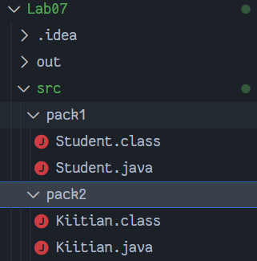
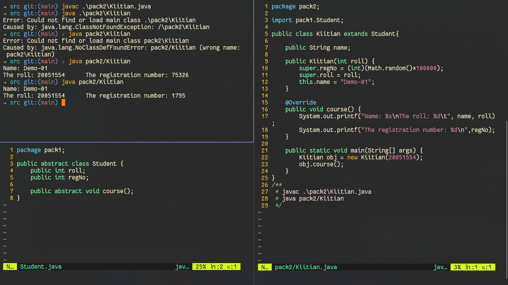

# WT Lab07
`Author: Dipankar Das`

`Date: 25-3-2022`

`Roll: 20051554`

## Question 1
Illustrate the usage of abstract class with following Java classes –
1. An abstract class student (package name- pack1)with data member roll no, reg no and a abstract method course().
2. A subclass kiitian (package name- pack2) with course() method implementation.

### Solution



#### `Student.java`

```JAVA
package pack1;

public abstract class Student {
    public int roll;
    public int regNo;

    public abstract void course();
}
```

#### `Kiitian.java`

```java
package pack2;

import pack1.Student;

public class Kiitian extends Student{

    public String name;

    public Kiitian(int roll) {
        super.regNo = (int)(Math.random()*100000);
        super.roll = roll;
        this.name = "Demo-01";
    }

    @Override
    public void course() {
        System.out.printf("Name: %s\nThe roll: %d\t", name, roll);
        System.out.printf("The registration number: %d\n",regNo);
    }

    public static void main(String[] args) {
        Kiitian obj = new Kiitian(20051554);
        obj.course();
    }
}

```

### Output

