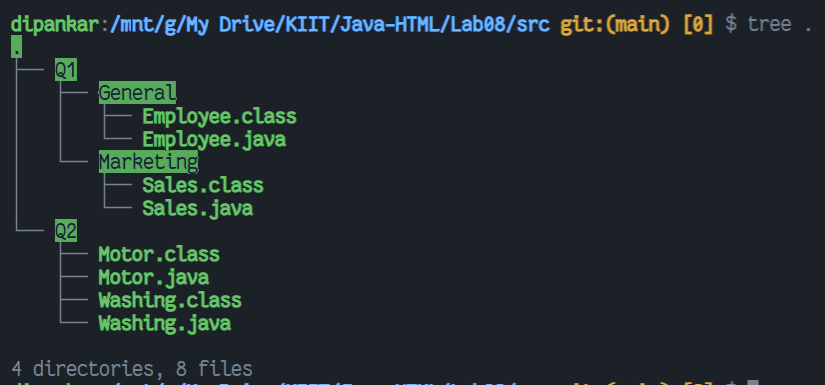
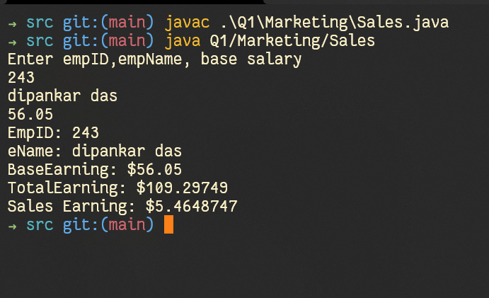
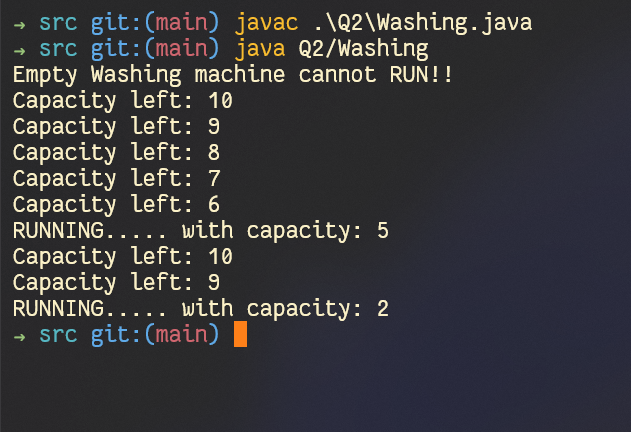

# WT Lab08
`Author: Dipankar Das`

`Date: 2-4-2022`

`Roll: 20051554`

## Project structure


## Question 1
Define two packages as – General and Marketing.  In General package define a class `employee` with data members as `empid(protected)`, `ename(private)` and a public method as `earnings()` which calculate total earnings as 
`earnings = basic + DA (80% of basic) + HRA (15% of basic)`. In Marketing package 
define a class ,`sales` which is extending from ,employee class and has a method `tallowance()` which calculates Travelling Allowance as 5% of total earning.  Write the programs to find out total earning of a sales person for the given basic salary amount and print along with the emp id.

### Solution

#### `Marketing/Sales.java`

```JAVA
package Q1.Marketing;

import java.util.Scanner;

public class Sales extends Q1.General.Employee {

    public Sales(int empId, String eName, float baseEarnings) {
        super(empId, eName, baseEarnings);
    }

    public float travAllowance(){
        return 0.05f * super.earnings();
    }

    public void getInfo() {
        System.out.println("EmpID: " + super.empId);
        System.out.println("eName: "+super.geteName());
        System.out.println("BaseEarning: $" + super.baseEarnings);
        System.out.println("TotalEarning: $" + super.earnings());
        System.out.println("Sales Earning: $" + travAllowance());
    }

    public static void main(String[] args) {
        System.out.println("Enter empID,empName, base salary");
        Scanner inp = new Scanner(System.in);
        int id = inp.nextInt();
        inp.nextLine(); // This line you have to add (It consumes the \n character)
        String nn = inp.nextLine();
        float base = inp.nextFloat();
        Sales sal = new Sales(id, nn, base);
        inp.close();
        sal.getInfo();
    }
}

```

#### `General/Employee.java`

```java
package Q1.General;


public class Employee {
    protected int empId;
    private String eName;

    public Employee(int empId, String eName, float baseEarnings) {
        this.empId = empId;
        this.eName = eName;
        this.baseEarnings = baseEarnings;
    }

    public float baseEarnings;

    /**
     * it calculates the totalEarning from the given base_salary
     * @return float the totalEarning
     */
    public float earnings(){
        return baseEarnings * (1.0f + 0.8f + 0.15f);
    }
    protected String geteName() {
        return this.eName;
    }
}

```
### Output



## Question 2
Define an interface `Motor` with a data member `capacity` and two methods such as `run() and consume()`. 
Define a Java class `Washing` machine which implements this interface and write the code to check the value of the interface data member with an object of the class.

### Solution

#### `Washing.java`

```java
package Q2;

public interface Motor {
    public final int CAPACITY = 10;
    public void run();
    public void consume();
}

```

#### `Washing.java`

```java
package Q2;

public class Washing implements Q2.Motor {

    class ErrorE extends Throwable {
        public String whatC() {
            return "No more capacity left";
        }
        public String whatR() {
            return "Empty Washing machine cannot RUN!!";
        }
    }

    protected int currCap;

    public Washing() {
        this.currCap = CAPACITY;
    }

    @Override
    public void run() {
        try {
            if ((CAPACITY - currCap) == 0)
                throw new ErrorE();
            System.out.println("RUNNING..... with capacity: "+(CAPACITY - currCap));
            currCap = CAPACITY;
        }catch(ErrorE e) {
            System.out.println(e.whatR());
        }
    }

    @Override
    public void consume() {
        try {
            if (currCap == 0)
                throw new ErrorE();
            System.out.println("Capacity left: " + currCap--);
        }catch(ErrorE e) {
            System.out.println(e.whatC());
        }
    }

    public static void main(String[] args) {
        Washing was = new Washing();
        was.run();
        was.consume();
        was.consume();
        was.consume();
        was.consume();
        was.consume();
        was.run();
        was.consume();
        was.consume();
        was.run();
    }
}

```

### Output

