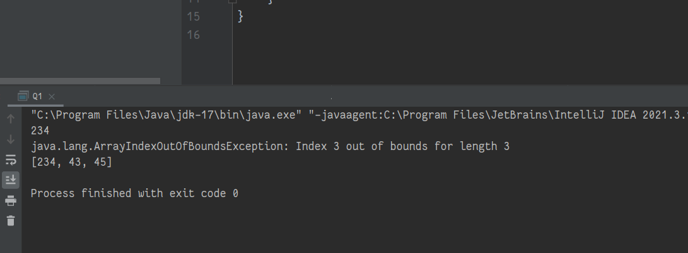
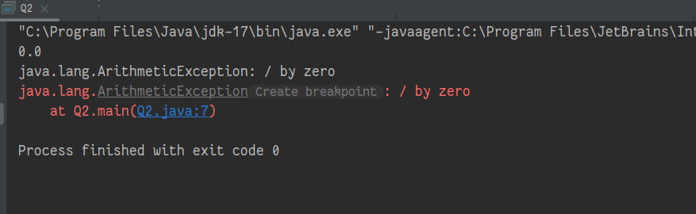
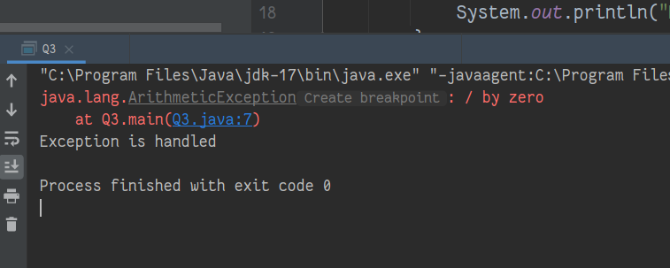

# WT Lab09
`Author: Dipankar Das`

`Date: 8-4-2022`

`Roll: 20051554`

## Question 1
Write a Java program to generate an ArrayIndexOutofBoundsException and handle it 
using catch statement

### Solution

```JAVA
import java.util.Arrays;

public class Q1 {
    public static void main(String[] args) {
        int[] arr = new int[]{234,43,45};
        try {
            System.out.println(arr[0]);
            System.out.println(arr[arr.length]);
        } catch (ArrayIndexOutOfBoundsException e) {
            System.out.println(e);
        } finally {
            System.out.println(Arrays.toString(arr));
        }
    }
}
```
### Output



## Question 2
A subclass exception must appear before super-class exception. Justify this with suitable 
Java programs

### Solution

```java
public class Q2 {
    public static void main(String[] args) {
        int a = 5;
        int b = 0;
        try {
            System.out.println(b / (float)a);
            System.out.println(a / b);
        } catch (Exception e) {
            System.out.println(e);
        } catch (ArithmeticException e) { //placing it here will cause compile time error
            e.printStackTrace();
            System.out.println(e);
        }
    }
}
```

### Output


## Question 3
Write a Java program to illustrate try..catch..finally block

### Solution

```java
public class Q3 {
    public int a;

    public static void main(String[] args) {
        Q3 obj = null;
        try {
            System.out.println(3/0);
            if (obj.a == 5) {
                System.out.println(obj.a);
            }
        } catch (ArithmeticException e) {
            e.printStackTrace();
        } catch (NullPointerException e) {
            e.printStackTrace();
        } catch (Exception e) {
            e.printStackTrace();
        } finally {
            System.out.println("Exception is handled");
        }
    }
}
```

### Output

