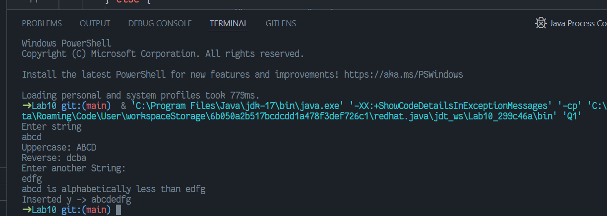
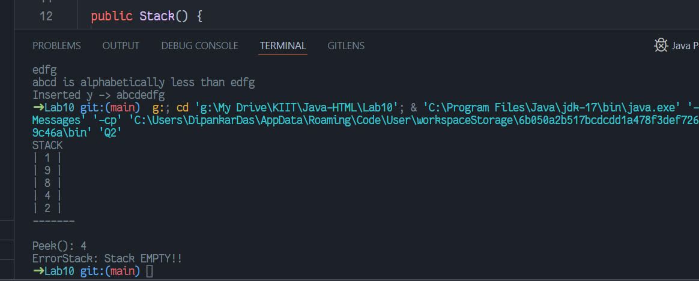
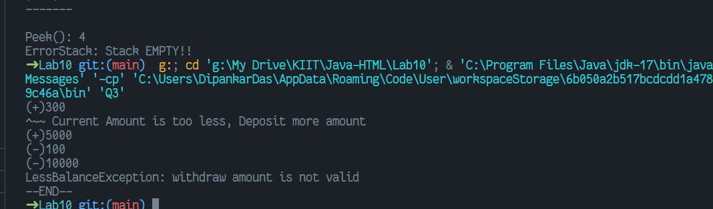
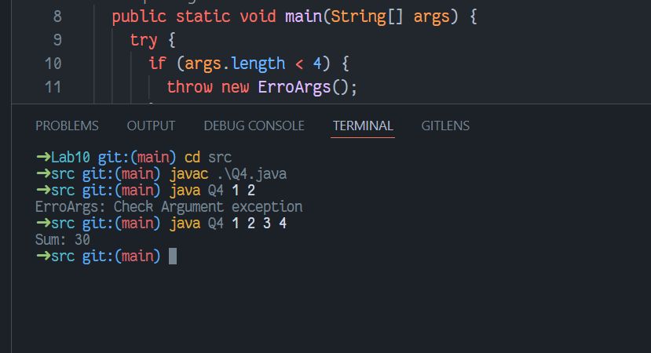

# WT Lab10
`Author: Dipankar Das`

`Date: 22-4-2022`

`Roll: 20051554`

## Question 1
Write a program to perform following operations on user entered strings –
1. Change the case of the string
2. Reverse the string
3. Compare two strings
4. Insert one string into another strings

### Solution

```JAVA
import java.util.Scanner;

public class Q1 {
    public static void main(String[] args) {
        Scanner in = new Scanner(System.in);
        System.out.println("Enter string");
        String x = in.nextLine();
        String lX = x.toLowerCase();
        if (lX.equals(x)) {
            System.out.println("Uppercase: "+x.toUpperCase());
        } else {
            System.out.println("Lowercase: "+lX);
        }
        StringBuilder xyz = new StringBuilder(x);
        System.out.println("Reverse: " + xyz.reverse().toString());
        
        System.out.println("Enter another String: ");
        String y = in.nextLine();

        int diff = x.compareTo(y);
        if (diff > 0) {
            System.out.println(x + " is alphabetically greater than " + y);
        } else if (diff < 0) {
            System.out.println(x + " is alphabetically less than " + y);
        } else {
            System.out.println(x + " Equal " + y);
        }
        x = x.concat(y);
        System.out.println("Inserted y -> " + x);
        in.close();
    }
}
```
### Output



## Question 2
Write a java program to implement a stack class having methods push () and pop().
These methods must be designed to throw user defined exception when the stack is
empty or full.

### Solution

```java
class ErrorStack extends Exception {
  ErrorStack(String x) {
    super(x);
  }
}

class Stack {
  private final int CAP = 30;
  private int[] arr;
  private int top;

  public Stack() {
    top = -1;
    arr = new int[CAP];
  }

  public int peek() throws ErrorStack  {
    if (top == -1) {
      throw new ErrorStack("Stack EMPTY!!");
    }
    return arr[top];
  }

  public void pop() throws ErrorStack {
    if (top == -1) {
      throw new ErrorStack("Stack EMPTY!!");
    }
    arr[top] = -9999;
    top--;
  }
  
  public void push(int x) throws ErrorStack {
    if (top == CAP - 1) {
      throw new ErrorStack("Stack FULL!!");
    }
    arr[++top] = x;
  }

  public void disStackContents() {
    System.out.println("STACK");
    for (int i = top; i >= 0; i--) {
      System.out.println("| " + arr[i] + " |");
    }
    System.out.println("------\n");
  }
}

public class Q2 {
  public static void main(String[] args) {
    Stack stk = new Stack();
    try {
      stk.push(2);
      stk.push(4);
      stk.push(8);
      stk.push(9);
      stk.push(1);
      stk.disStackContents();
      stk.pop();
      stk.pop();
      stk.pop();
      System.out.println("Peek(): "+stk.peek());
      stk.pop();
      stk.pop();
      stk.pop();
    } catch (ErrorStack e) {
      System.out.println(e);
    }
  }
}
```

### Output


## Question 3
Write a java program to create Account with 500 rupee minimum balance,
deposit amount, withdraw amount and also throws LessBalanceException which
returns the statement that says withdraw amount is not valid.


### Solution

```java
class LessBalanceException extends Exception {
  LessBalanceException(String x) {
    super(x);
  }
}

class Account {
  long deposit;
  private final long MINACC = 500;

  Account() {
    deposit = 0l;
  }

  public void deposit(int x) {
    System.out.println("(+)"+x);
    if (deposit + x <= MINACC) {
      System.out.println("^~~ Current Amount is too less, Deposit more amount");
      return;
    }

    deposit += x;
  }
  
  public void withdraw(int withdraw) throws LessBalanceException{
    System.out.println("(-)"+withdraw);
    if (deposit - withdraw <= MINACC) {
      throw new LessBalanceException("withdraw amount is not valid");
    }
    deposit -= withdraw;
  }
}


public class Q3 {
  public static void main(String[] args) {
    Account acc = new Account();
    try {
      acc.deposit(300);
      acc.deposit(5000);
      acc.withdraw(100);
      acc.withdraw(10000);

    } catch (LessBalanceException e) {
      System.out.println(e);
    } finally {
      System.out.println("--END--");
    }
  }
}
```

### Output


## Question 4
Create an user defined exception named Check Argument to check the
number of arguments passed through command line. If the number of
arguments is less than four, throw the Check Argument exception, else print the
addition of squares of all the four elements.


### Solution

```java
class ErroArgs extends Exception {
  ErroArgs() {
    super("Check Argument exception");
  }
}

public class Q4 {
  public static void main(String[] args) {
    try {
      if (args.length < 4) {
        throw new ErroArgs();
      }
      int sum = 0;
      for (String ss : args) {
        int x = Integer.valueOf(ss);
        sum += x * x;
      }
      System.out.println("Sum: " + sum);

    } catch (ErroArgs e) {
      System.out.println(e);
    }
  }
}
```

### Output

